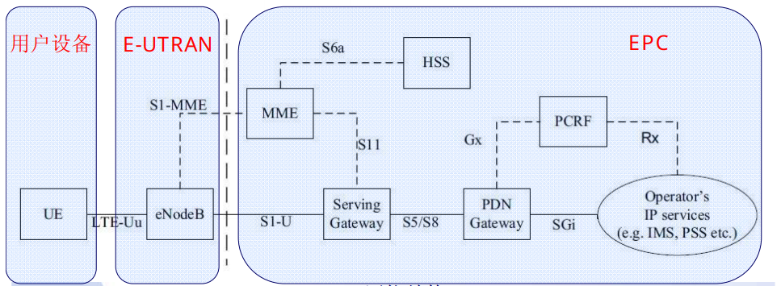
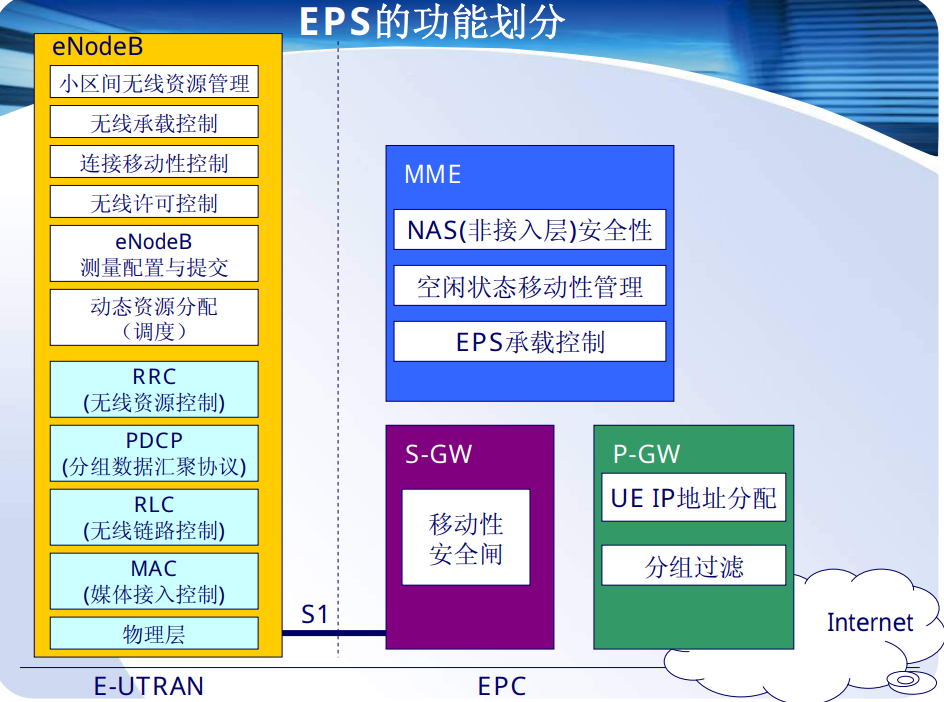
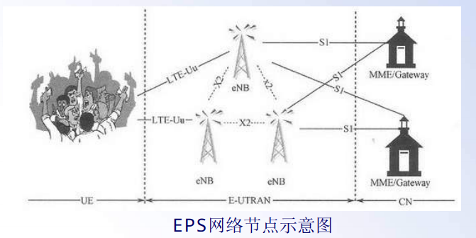
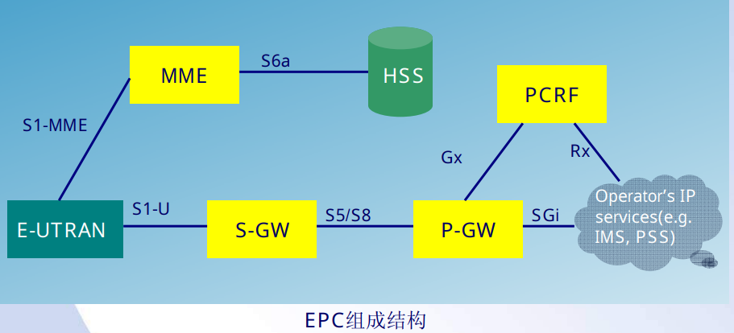
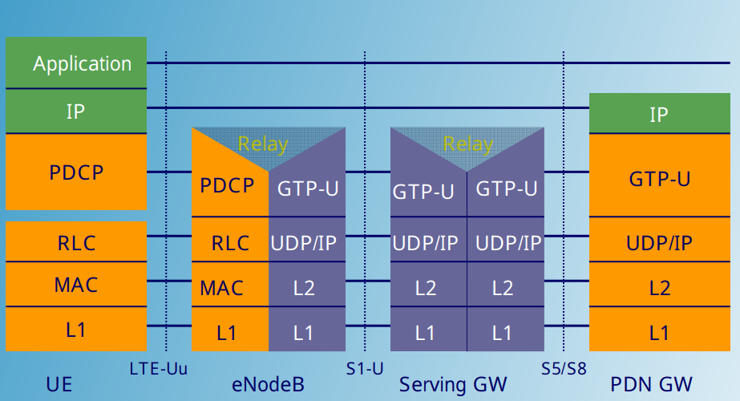
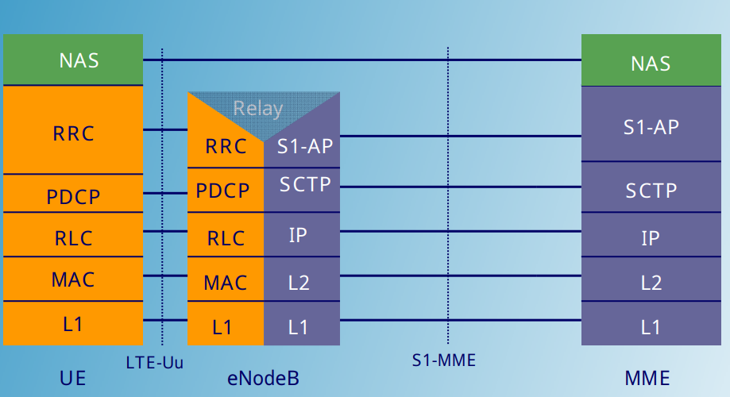
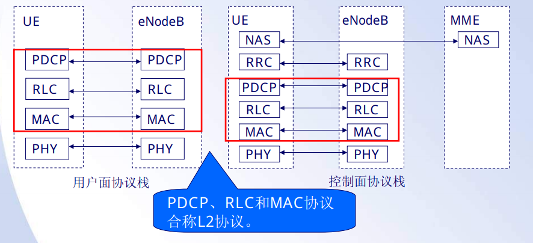

# LTE系统结构

## 背景介绍

### 移动通信系统发展历程

### LTE演进路线

### LTE主要技术特征

### LTE关键技术

#### 多载波技术

#### 多天线技术

#### 分组交换

## 网络架构与协议

LTE致力于无线接入网的演进(E-UTRAN)，系统架构演进(SAE)则致力于分组网络的演进(演进型分组核心网EPC)，LTE和SAE共同组成演进型分组系统(EPS)

### LTE网络组成

整个TD-LTE系统由3部分组成：

- 核心网 (EPC, Evolved Packet Core)
- 接入网 (E-UTRAN, 主要由eNodeB组成)
- 用户设备 (UE)

其具体功能划分如下：

### 网络接口

LTE主要有三种网络接口：

- S1接口：eNodeB与EPC之间
- X2接口：eNodeB之间
- Uu接口：eNodeB与UE之间

### eNodeB功能

- 无线资源管理
- IP数据包头压缩与用户数据流加密
- UE连接期间选择MME
- 寻呼消息的调度与传输
- 广播消息的调度与传输
- 移动和调度的测量，并进行测量和测量报告的配置

###EPC构成

EPC主要负责UE的控制和承载建立，主要分为三部分：

- MME (Mobility Management Entity, 负责信令处理部分)
- S-GW (Serving Gateway, 负责本地网络用户数据处理部分)
- P-GW (PDN Gateway, 负责用户数据包与其他网络的处理)

可能还有的其他节点：

- HSS: Home Subscriber Server
- PCRF: Policy Control and Charging Rules Function

### 

#### MME功能

- 寻呼消息分发，MME负责将寻呼消息按照一定的原则分发到相关的eNodeB
- 处理UE和EPC之间的控制信令，通过NAS协议实现
- EPC承载控制
- 保证NAS信令安全
- 空闲状态的移动性管理

#### S-GW功能

- 所有的IP数据包均通过S-GW
- 支持由于UE移动性产生的用户平面切换
- 终止由于寻呼原因产生的用户平面数据包

#### P-GW功能

- UE的IP地址分配
- IP数据包过滤
- QoS保证
- 计费

### 无线接口协议

无线接口协议根据用途分为用户面(User Plane)协议栈和控制面(Control Plane)协议栈

#### 用户面整体协议栈

#### 控制面整体协议栈

- 用户面和控制面协议栈均包换PHY，MAC，RLC和PDCP层，控制面向上还包含RRC和NAS层

## 控制面协议

### 

## 用户面协议

### 包数据汇聚层(PDCP)

### 虚线链路层(RLC)

### 媒体接入层(MAC)

### 物理层(PHY)