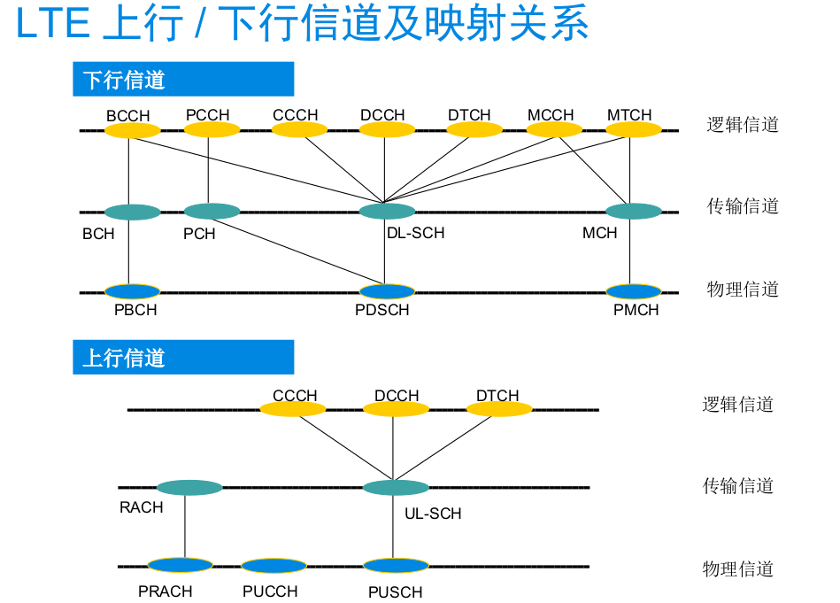

# LTE系统结构

## 背景介绍

### 移动通信系统发展历程

### LTE演进路线

### LTE主要技术特征

### LTE关键技术

#### 多载波技术

#### 多天线技术

#### 分组交换

## 网络架构与协议

LTE致力于无线接入网的演进(E-UTRAN)，系统架构演进(SAE)则致力于分组网络的演进(演进型分组核心网EPC)，LTE和SAE共同组成演进型分组系统(EPS)

### LTE网络组成

整个TD-LTE系统由3部分组成：

- 核心网 (EPC, Evolved Packet Core)
- 接入网 (E-UTRAN, 主要由eNodeB组成)
- 用户设备 (UE)

其具体功能划分如下：

### 网络接口

LTE主要有三种网络接口：

- S1接口：eNodeB与EPC之间
- X2接口：eNodeB之间
- Uu接口：eNodeB与UE之间

### eNodeB功能

- 无线资源管理
- IP数据包头压缩与用户数据流加密
- UE连接期间选择MME
- 寻呼消息的调度与传输
- 广播消息的调度与传输
- 移动和调度的测量，并进行测量和测量报告的配置

###EPC构成

EPC主要负责UE的控制和承载建立，主要分为三部分：

- MME (Mobility Management Entity, 负责信令处理部分)
- S-GW (Serving Gateway, 负责本地网络用户数据处理部分)
- P-GW (PDN Gateway, 负责用户数据包与其他网络的处理)

可能还有的其他节点：

- HSS: Home Subscriber Server
- PCRF: Policy Control and Charging Rules Function

### 

#### MME功能

- 寻呼消息分发，MME负责将寻呼消息按照一定的原则分发到相关的eNodeB
- 处理UE和EPC之间的控制信令，通过NAS协议实现
- EPC承载控制
- 保证NAS信令安全
- 空闲状态的移动性管理

#### S-GW功能

- 所有的IP数据包均通过S-GW
- 支持由于UE移动性产生的用户平面切换
- 终止由于寻呼原因产生的用户平面数据包

#### P-GW功能

- UE的IP地址分配
- IP数据包过滤
- QoS保证
- 计费

### 无线接口协议

无线接口协议根据用途分为用户面(User Plane)协议栈和控制面(Control Plane)协议栈

#### 用户面整体协议栈

#### 控制面整体协议栈

- 用户面和控制面协议栈均包换PHY，MAC，RLC和PDCP层，控制面向上还包含RRC和NAS层

- L2下行结构

  

- L2上行结构

  

## L3协议

### NAS协议

### RRC协议

#### 随机接入

##### 基于竞争的随机接入

##### 基于非竞争的随机接入

#### 寻呼

##### 寻呼的发送

- 有网络向空闲态或连接态的UE发起
- Paging消息会在UE注册的所有小区发送(TA范围内)
  - 核心网触发：通知UE接收寻呼请求(被叫，数据推送)
  - eNodeB触发：通知系统消息更新以及通知UE接收ETWS等信息
  - 在S1AP接口消息中，MME对eNodeB发paging消息，每个Paging消息携带一个被寻呼UE消息
  - eNodeB读取Paging消息中的TA列表，并在其下属于该列表内的小区进行空口寻呼
  - 如果之前UE已经将DRX消息通过NAS告诉MME，则MME会将该信息通过paging消息告诉eNodeB
  - 空口进行寻呼消息传输时，eNodeB将具有相同寻呼时机的UE寻呼内容汇总在一条寻呼消息里
  - 寻呼消息被映射到PCCH逻辑信道中，并根据UE的DRX周期在PDSCH上发送

##### 寻呼的读取

- UE寻呼消息的接收遵循DRX的原则
  - UE根据DRX周期在特定时刻根据P-RNTI读取PDCCH
  - UE根据PDCCH的指示读取相应PDSCH，并将解码的数据通过寻呼传输信道(PCH)传到MAC层

#### RRC连接建立

- 触发原因：
  - IDLE态UE需变为连接态时发起该过程，如呼叫、响应寻呼、TAU、Attach等
- RRC连接成功流程
  - RRC连接请求：UE通过UL_CCCH在SRB0上发送，携带UE的初始NAS标识和建立原因等
  - RRC连接建立：eNodeB通过DL_CCCH在SRB0上发送，携带SRB1的完整配置信息
  - RRC连接建立完成：UE通过UL_DCCH在SRB1上发送，写到上行方向NAS消息，如Attach Request，TAU Request， Service Request， Detach Request，eNodeB根据这些消息进行S1口的建立
- RRC连接建立失败
  - 第二步中，如果eNodeB拒绝为UE建立RRC连接，则通过DL_CCCH在SRB0上回复一条RRC连接拒绝消息

#### RRC连接重建

#### RRC连接重配

#### RRC连接释放

#### 测量

### 端到端业务建立/释放流程

#### Attach流程

#### Detach流程

#### Service Request流程

#### 专用承载建立流程

#### 专用承载修改流程

#### 专用承载释放流程

### 

## L2协议

### 包数据汇聚层(PDCP)

#### PDCP层功能

- 头压缩和解压缩，只支持一种压缩算法，即ROHC算法
- 用户名或控制面的数据压缩，此功能用于PDCP用户见的数据传递
- 提供PDCP序列号，供无线承载使用
- 切换时对上层PDU的顺序递交
- 下层SDU的复制与检测
- 用户面数据和控制面数据的加密
- 控制面数据的完整性保护和验证
- 基于定时器的丢包

#### PDCP层控制面结构

#### PDCP用户面结构

### 虚线链路层(RLC)

#### TM实体

#### UM实体

#### AM实体

#### RLC功能

- 传送RLC PDU
- 通过ARQ，进行错误校验
- 分段、组合和重组RLC SDU(仅在UM和AM数据传输时)
- 重新分段和重新组合RLC PDU(仅在AM数据传输时)
- 上层PDU的顺序发送(仅在UM和AM数据传输时)
- 复制检测，检测收到的RLC PDU复制(仅在UM和AM数据传输时)
- RLC SDU丢弃(仅在UM和AM数据传输时)
- RLC连接重建
- 协议的错误发现和恢复机制
- eNB和UE之间的流控制

### 媒体接入层(MAC)

## L1层

### 物理层(PHY)

### 补充：基础知识

#### 无线帧结构

##### FDD

- 每个10ms无线帧被分为10个子帧
- 每个子帧包含两个时隙，每时隙长0.5ms
- Ts=1/(1500*2048) 是基本时间单元
- 任何一个子帧即可以作为上行，也可以作为下行

##### TDD

- 每个10ms无线帧包括2个长度为5ms的半帧，每个半帧由4个数据子帧和1个特殊子帧组成
- 特殊子帧包括3个特殊时隙：DwPTS，GP和UpPTS，总长度为1ms
- 支持5ms和10ms上下行切换点
- 子帧0、5和DwPTS总是用于下行发送

#### 逻辑信道

MAC向RLC以逻辑信道的形式提供服务。逻辑信道由其承载的信息类型所定义，分为CCH和TCH，前者用于传输LTE系统所必需的控制和配置信息，后者用于传输用户数据。LTE规定的逻辑信道类型如下：

- BCCH信道，广播控制信道，用于传输从网络到小区中所有移动终端的系统控制信息。移动终端需要读取在BCCH上发送的系统信息，如系统带宽等。
- PCCH，寻呼控制信道，用于寻呼位于小区级别中的移动终端，终端的位置网络不知道，因此寻呼消息需要发到多个小区。
- DCCH，专用控制信道，用于传输来去于网络和移动终端之间的控制信息。该信道用于移动终端单独的配置，诸如不同的切换消息
- MCCH，多播控制信道，用于传输请求接收MTCH信息的控制信息。
- DTCH，专用业务信道，用于传输来去于网络和移动终端之间的用户数据。这是用于传输所有上行链路和非MBMS下行用户数据的逻辑信道类型。
- MTCH，多播业务信道，用于发送下行的MBMS业务 

#### 传输信道

- 对物理层而言，MAC以传输信道的形式使用物理层提供的服务。 

- LTE中规定的传输信道类型如下：

  - BCH：广播信道，用于传输BCCH逻辑信道上的信息。
  - PCH：寻呼信道，用于传输在PCCH逻辑信道上的寻呼信息。
  - DL-SCH：下行共享信道，用于在LTE中传输下行数据的传输信道。它支持诸如动态速率适配、时域和频域的依赖于信道的调度、HARQ和空域复用等LTE的特性。类似于HSPA中的CPC。DL-SCH的TTI是1ms。
  - MCH：多播信道，用于支持MBMS。
  - UL-SCH：上行共享信道，和DL-SCH对应的上行信道 

#### 物理信道

物理信道是一系列资源粒子的集合，用于承载源于高层的信息

- 上行物理信道
  - PUSCH
  - PUCCH
  - PRACH
- 下行物理信道
  - PDSCH
  - PBCH
  - PMCH
  - PCFICH
  - PDCCH
  - PHICH

#### LTE上行/下行信道及映射关系

